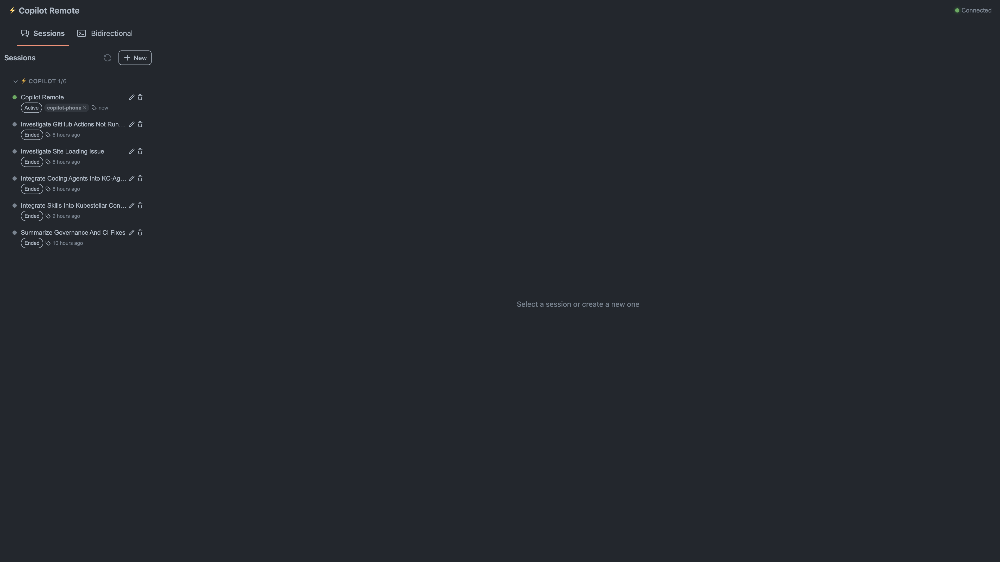
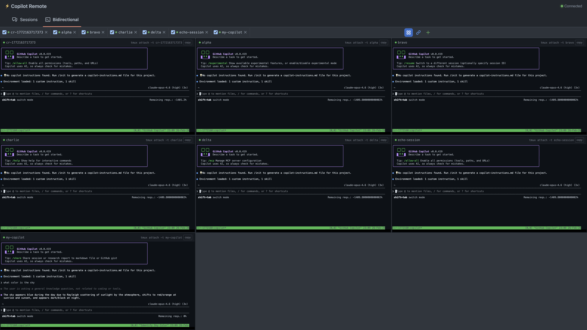
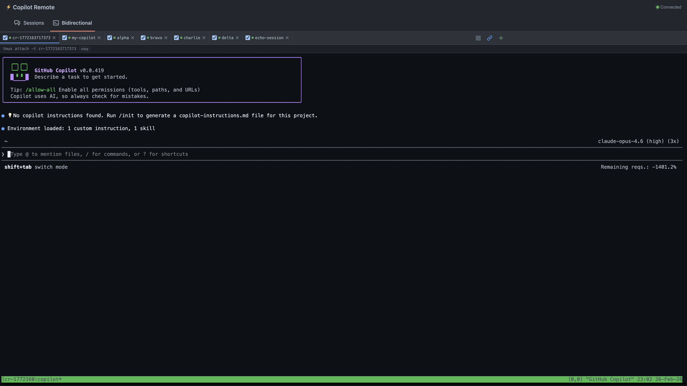

# ⚡ Copilot Remote

Control your AI coding agents from literally anywhere. Manage Copilot CLI and Claude Code sessions, run multiple agents side-by-side in tiled web terminals, queue up tasks and let them auto-dispatch across your agents, drag images straight into terminals, and stream everything in real-time — all from your phone or any browser on your local network.

## Screenshots

### Session Browser
Browse and manage all your AI CLI sessions — active, ended, and historical — with custom names, tags, and real-time status indicators.



### Tiled Terminals
Run multiple AI agents side-by-side in a tiled grid. Each tile is a live tmux session with independent sizing, copy support, and tmux attach commands.



### Single Terminal
Full-screen terminal view with tab bar, green status dots for connected sessions, and one-click tmux attach copy.



## How It Works

```
+---------------------+       local WiFi        +-------------------------+
|  Phone / Browser    |  <-- WebSocket+REST --> |  Laptop                 |
|  (PWA)              |      :5173 -> :3001     |  (Node.js server)       |
|                     |                         |                         |
|  Chat UI            |                         |  Spawns AI CLIs         |
|  Tiled terminals    |                         |  Manages tmux sessions  |
|  Todo queue         |                         |  ACP streaming          |
|  Tags / rename      |                         |  Reads ~/.copilot/      |
+---------------------+                         +-------------------------+
```

The **server** runs on your laptop alongside your AI CLI installations (Copilot CLI, Claude Code). It spawns and manages AI processes via ACP streaming, provides interactive web terminals backed by tmux and node-pty, reads historical sessions from `~/.copilot/session-state/`, and streams everything over WebSocket.

The **web app** is a React PWA built with [GitHub Primer](https://primer.style/react/) and xterm.js. It connects to the server over your local network, provides a chat interface with full terminal emulation, tiled multi-terminal layouts, a task queue that auto-dispatches work to your agents, and lets you manage sessions with custom names, tags, and real-time status.

## Features

### Core
- **📋 Session Browser** — Lists all AI CLI sessions: running (managed), active (detected via filesystem), and historical (from `~/.copilot/session-state/`)
- **🚀 Start Sessions** — Launch new Copilot or Claude sessions with a prompt, working directory, or resume an existing session
- **💬 iMessage-style Chat** — Send messages and see responses as compact chat bubbles with markdown rendering, inline icons, and short timestamps
- **⚡ ACP Streaming** — Real-time streaming via the Agent Client Protocol with persistent `copilot --acp` processes for multi-turn conversations with live text chunks and tool call status
- **🔄 Resume Sessions** — Pick up where you left off with `--resume <sessionId>`
- **🗑️ Delete & Purge Sessions** — Hide sessions from the list or permanently delete session files from disk with a confirmation dialog

### Todo Queue (Task Dispatcher)

This is basically a job queue for your AI agents. You add commands, and they get auto-dispatched to whichever terminal is free. It's like having a to-do list that does itself.

- **📝 Task Queue** — Add commands to a shared queue that auto-dispatches to idle terminals as they become available. Toggle it on/off whenever you want
- **🔁 Recurring Tasks** — Set any task to repeat on a schedule (every 30s, 1min, 5min, etc.). Perfect for things like "check the build" or "run the tests" on a loop
- **⏱️ Schedule Picker** — Click the clock icon on any task to set it up as recurring with a custom interval. One click to add a schedule, one click to remove it
- **▶️ Run Now** — Got a scheduled task waiting for its next run? Hit "Run Now" to skip the wait and dispatch it immediately
- **📋 Queue Last Command** — See something cool running in a terminal? Hit the clipboard button in the tile header to grab whatever command was last sent and add it straight to your queue
- **✏️ Prompt Editor** — Double-click any task to open a full modal editor. The "Help from AI" button suggests improvements to save tokens and improve output clarity. One-click "Use suggestion" to apply
- **📏 Line Clamping** — Long prompts show max 4 lines with ellipsis in the queue. Hover to see the full text. Double-click to open the editor
- **📏 Resizable Panel** — Drag the left edge of the todo panel to make it wider or narrower. Your preferred width sticks across page refreshes
- **🔀 Reorder** — Move tasks up and down in the queue with arrow buttons to control what gets dispatched first
- **🧹 Clear Completed** — One button to clean out all the finished tasks
- **⏸️ Pause/Resume** — Queued items can be paused so they don't auto-dispatch until you're ready
- **💀 Kill Running** — Delete a task even while it's running if you change your mind

### Swarm Mode

Want your friends or teammates to add tasks to your queue from their own devices? Swarm mode lets you share access.

- **🔗 Invite Links** — Generate a one-time invite URL that gives someone else access to add tasks to your queue
- **🔒 Scoped Access** — Invite links only grant todo queue access, not full terminal control. Your terminals stay yours
- **🌐 Multi-device** — Multiple people can queue tasks simultaneously — the server syncs everything in real-time
- **📡 Server-synced** — All todo state is synced to the server so tasks added via the API show up instantly in your browser

### Web Terminals
- **🖥️ Interactive Terminals** — Full terminal emulation powered by xterm.js and node-pty, with cursor blinking, link detection, and responsive sizing
- **📐 Tile Mode** — Multiple terminals in a tiled grid layout on desktop, each showing a live xterm.js window with independent focus and keyboard shortcuts
- **🔗 Tmux Integration** — Terminals automatically run inside tmux sessions (`cr-<id>`) with mouse support, allowing sessions to persist and be reattached
- **🔍 Auto-discover** — New tmux sessions started on your desktop automatically appear as tabs in the web UI within seconds (polls every 3s)
- **♻️ Restart Resilience** — Server re-adopts orphaned tmux sessions on restart; no zombie accumulation across restarts
- **📏 Independent Sizing** — Each client (web and desktop terminal) gets its own window size via tmux session groups — no more dot-filled screens
- **🤖 Auto-launch AI CLI** — Automatically detects installed AI tools (Copilot CLI, Claude Code) and launches them in new terminals
- **🧹 Auto-cleanup** — Tabs automatically disappear 2 seconds after their underlying process exits
- **📋 Tmux Copy** — Copy tmux session info from tile headers for easy external attach
- **⌨️ Keyboard Shortcuts** — Navigate and manage tiles with keyboard shortcuts
- **🖱️ Right-click Support** — Browser context menu suppressed on terminal so tmux's native right-click menus work
- **📋 Clipboard Support** — Cmd+C, Cmd+V, Cmd+X, and Cmd+A all work natively in the browser. No more accidentally sending Ctrl-C to your terminal when you just wanted to copy some text
- **🖼️ Image Drag-and-Drop** — Drag screenshots or images directly onto any terminal tile. The file gets uploaded to the server and the file path gets pasted into the terminal, so your AI agent can actually see and process the image
- **🏷️ Tab Rename** — Double-click any tab name to rename it. Names persist across browser refreshes and server restarts
- **🗑️ Tab Terminate** — Click the trash icon on any tab to kill the underlying tmux session. Clean up terminals you're done with without leaving the browser
- **💡 Last Intent** — Each tile header shows what command was last sent to that terminal, so you can tell at a glance what each agent is working on
- **💾 State Persistence** — Your tile mode, which tabs are checked, and which tab is active all persist across page refreshes. Come back to exactly where you left off
- **✨ Session Title Summarization** — Click the sparkle button on any tab to generate an AI-summarized title based on what's happening in that terminal. Auto-summarizes on first prompt detection
- **🖱️ Focus Mode Toggle** — Switch between hover-to-focus and click-to-focus for terminal tiles. Hover mode automatically focuses whichever tile your mouse is over

### Rocket Scroll Fix

> **This is a solved problem.** We developed a 4-layer fix for the "rocket scroll" bug that affects every xterm.js-based web terminal running AI CLI tools. The fix has been submitted to GitHub Copilot CLI ([github/copilot-cli#1805](https://github.com/github/copilot-cli/issues/1805)) and references multiple Anthropic bug reports. Full technical details below.

AI CLI tools like Copilot CLI and Claude Code use rapid ANSI control sequences to render rich TUI interfaces. When combined with macOS trackpad momentum scrolling and unbounded data flow, this causes uncontrollable "rocket scroll" — the terminal oscillates at extreme speed, making sessions unusable. This is a [widely reported issue](https://github.com/anthropics/claude-code/issues/826) affecting users worldwide.

**Our 4-layer solution (PRs #150-#165):**

| Layer | What it does | Impact |
|-------|-------------|--------|
| **1. Wheel Interception** | Document-level capture handler blocks all native wheel events on `.xterm`, detects macOS momentum via delta decay patterns, re-dispatches clamped synthetic events (max ±3px, ~8/sec) | Eliminates trackpad momentum runaway |
| **2. RAF Write Batching** | `TerminalWriter` class accumulates WebSocket data and flushes once per `requestAnimationFrame` instead of per-chunk | Reduces `term.write()` from hundreds/sec to ~60/sec |
| **3. DEC 2026 Sync** | Detects `ESC[?2026h`/`ESC[?2026l` sequences, buffers during sync mode, flushes atomically | Prevents rendering intermediate TUI states |
| **4. Backpressure** | Tracks xterm.js write buffer size (128KB high / 16KB low watermarks), signals server to pause/resume PTY reads via WebSocket | Prevents unbounded memory growth and jank |

**Related Anthropic bug reports:** [#826](https://github.com/anthropics/claude-code/issues/826), [#3648](https://github.com/anthropics/claude-code/issues/3648), [#10304](https://github.com/anthropics/claude-code/issues/10304), [#10835](https://github.com/anthropics/claude-code/issues/10835), [#11719](https://github.com/anthropics/claude-code/issues/11719), [#11801](https://github.com/anthropics/claude-code/issues/11801), [#17938](https://github.com/anthropics/claude-code/issues/17938), [#1913](https://github.com/anthropics/claude-code/issues/1913)

**135 automated tests** cover all layers — momentum detection, RAF batching, DEC 2026 sync, backpressure watermarks, and font size interactions. Zero rocket scroll reports since deployment.

### Organization
- **🏷️ Session Names** — Rename sessions inline with a tap on the pencil icon
- **🎨 Color-coded Tags** — Add tags like `copilot-phone`, `bug`, `feature`, `docs` with automatic color coding
- **📌 Session Persistence** — Last active session is remembered across browser refreshes via localStorage

### Mobile
- **📱 Responsive Layout** — On mobile (<768px), sidebar and chat toggle with a back button for navigation
- **📱 Installable PWA** — Add to home screen on iOS/Android, runs in standalone mode without browser chrome
- **🌙 Dark Mode** — Proper dark theme using Primer's `dark_dimmed` scheme with explicit high-contrast colors

### Reliability
- **🔁 Auto-reconnect** — WebSocket reconnects automatically with exponential backoff; terminals auto-reconnect on server restart
- **♻️ Tmux Re-adopt** — On server restart, orphaned tmux sessions are automatically re-adopted with new grouped sessions — no zombie accumulation
- **🔄 Auto-restart** — `start.sh` script keeps both servers alive with infinite restart loops
- **🔒 Token Auth** — Server generates a random 256-bit token on first run; all API/WebSocket calls require it
- **🤖 Auto-QA** — GitHub Actions workflow runs hourly quality checks (build, lint, security, a11y, performance) with rotating focus areas
- **🧪 Nightly E2E Tests** — Playwright-based nightly workflow tests clipboard, tile mode, persistence, scroll containment, and WebSocket reconnection. Auto-creates GitHub issues on failure
- **🧪 135 Unit Tests** — 90 server-side tests (rate limiter, blocklist, prompt detector, session meta, todo store) + 45 web tests (scroll handler, TerminalWriter, font size, focus mode)
- **🔄 Self-Update** — Update button in the toolbar checks for new commits on main, shows behind count, and can pull + rebuild + restart the server in one click
- **🧹 Session Dedup** — Server prevents duplicate terminal attachments; client cleans up stale terminals on reconnect
- **🛡️ Error Boundary** — React ErrorBoundary catches render crashes and shows a recovery UI instead of a blank white screen. Your app won't just die on you
- **♿ Accessibility** — All interactive elements have proper ARIA labels and keyboard equivalents. Screen readers and keyboard-only navigation actually work

### UX Polish
- **⎋ Double-Escape Clear** — Hit Escape twice quickly to clear whatever you're typing in the chat input or todo input. Way faster than selecting all and deleting
- **📝 Multiline Inputs** — The todo queue input and inline editor both support multiline text with Shift+Enter. Auto-growing textareas expand as you type so you can see your whole prompt
- **🔑 Login Instructions** — The login page now shows you exactly where to find your auth token and how to connect, so you don't have to dig through terminal output

### Performance
- **⚡ Memoized Rendering** — `React.memo` on MessageBubble and `useMemo` on message arrays prevent re-rendering 500+ messages on every keystroke
- **📊 Smart Filtering** — Empty-content events (tool call artifacts) are filtered out, keeping only meaningful messages
- **⏸️ Polling Pause** — Session list polling pauses during inline editing to prevent input lag
- **🚀 TerminalWriter** — RAF-based write batching + DEC 2026 synchronized output + backpressure watermarks prevent data flood from AI CLI output (see [Rocket Scroll Fix](#rocket-scroll-fix))

## Prerequisites

- **Node.js 18+** and **npm 9+**
- **tmux** installed (`brew install tmux` / `apt install tmux`)
- **GitHub Copilot CLI** and/or **Claude Code** installed and authenticated
- Laptop and phone on the **same WiFi network**

## Installation

```bash
git clone https://github.com/kubestellar/copilot-remote.git
cd copilot-remote
npm install
```

## Usage

### 1. Start the servers

**Recommended** — persistent with auto-restart:

```bash
./start.sh
```

This launches both the **API server** (port 3001) and the **Vite dev server** (port 5173) with automatic restart on crash. Logs go to `logs/server.log` and `logs/vite.log`.

**Alternative** — manual start:

```bash
npm run dev
```

On first run, you'll see:

```
🚀 Copilot Remote server running on http://0.0.0.0:3001
👀 Watching 12 session(s) for live updates (polling every 1500ms)

🔑 Auth token: a1b2c3d4e5f6...

   Use this token to connect from your phone.
   It's saved in ~/.copilot-remote/auth-token
```

### 2. Open on your phone

Find your laptop's local IP:

```bash
# macOS
ipconfig getifaddr en0

# Linux
hostname -I | awk '{print $1}'
```

Open `http://<laptop-ip>:5173` on your phone's browser.

### 3. Connect

On first visit, you'll see a setup screen with instructions. Enter:
- **Auth Token** — the token displayed when the server started (also saved at `~/.copilot-remote/auth-token`)
- **Server URL** (optional) — only needed if not using the Vite proxy (e.g., `http://192.168.1.100:3001`)

### 4. Start a session

Tap **+ New**, enter a prompt like `"Fix the failing tests in src/"`, optionally set a working directory, and hit **Create Session**. Copilot starts working and you'll see its output stream in real-time as chat messages.

### 5. Use the Todo Queue

Switch to the **Terminals** tab (it opens by default), and toggle **Todo Mode** on. Now you can:

1. **Add tasks** — Type commands in the input box at the bottom of the todo panel and hit Enter
2. **Watch them run** — Tasks auto-dispatch to idle terminals and show "running in: tab-name" while they execute
3. **Set up recurring** — Click the clock icon on any task to make it repeat on a schedule
4. **Grab last commands** — Click the clipboard icon in a tile header to capture whatever was last sent to that terminal and add it to your queue
5. **Edit inline** — Double-click any task to modify its text before it runs
6. **Drag images** — Drop a screenshot onto any terminal to upload it and paste the path

### 6. Manage sessions

- **Rename** — Tap the pencil icon next to any session to set a custom name
- **Tag** — Tap the tag icon to add color-coded tags (e.g., `bug`, `feature`, `docs`)
- **Resume** — Tap any ended session and hit **Resume** or type a follow-up message

### 7. Install as PWA

On your phone's browser, tap **Share → Add to Home Screen** (iOS) or the install banner (Android/Chrome). The app runs in standalone mode without browser chrome.

## Project Structure

```
copilot-remote/
├── server/                     # Node.js backend
│   ├── src/
│   │   ├── index.ts            # Express + WebSocket server, REST API routes
│   │   ├── session-manager.ts  # PTY lifecycle: spawn, track, stream, kill
│   │   ├── session-store.ts    # Reads ~/.copilot/session-state/ for history
│   │   ├── session-watcher.ts  # Live-tails events.jsonl with byte-offset reads
│   │   ├── session-meta.ts     # CRUD for session names/tags in ~/.copilot-remote/
│   │   ├── terminal-manager.ts # Web terminal + tmux session management
│   │   ├── acp-manager.ts      # Agent Control Protocol streaming for AI CLIs
│   │   ├── auth.ts             # Token generation, middleware, WS validation
│   │   └── types.ts            # Shared TypeScript interfaces
│   ├── package.json
│   └── tsconfig.json
├── web/                        # React PWA frontend
│   ├── src/
│   │   ├── App.tsx             # Root: responsive layout, state, WS handler
│   │   ├── main.tsx            # Entry: Primer ThemeProvider (dark_dimmed)
│   │   ├── components/
│   │   │   ├── SessionList.tsx     # Compact session list with inline rename/tags
│   │   │   ├── ChatView.tsx        # iMessage-style chat with back navigation
│   │   │   ├── MessageBubble.tsx   # Memoized message with inline markdown
│   │   │   ├── TerminalView.tsx    # xterm.js tiled terminal grid with tmux
│   │   │   ├── TodoPanel.tsx       # Task queue UI with inline edit, recurring
│   │   │   ├── NewSessionDialog.tsx# Create/resume session form
│   │   │   └── ConnectionStatus.tsx# Green/red dot indicator
│   │   ├── hooks/
│   │   │   ├── useWebSocket.ts     # WS connection with auto-reconnect
│   │   │   ├── useSessions.ts      # Session list polling with pause support
│   │   │   └── useTodoDispatcher.ts# Todo queue state, dispatch, recurring logic
│   │   ├── lib/
│   │   │   └── api.ts              # REST client (fetch wrapper + file upload)
│   │   └── types.ts                # Session, ChatMessage, TodoItem interfaces
│   ├── vite.config.ts          # Vite + PWA + proxy config
│   ├── index.html              # Dark mode data attributes for Primer CSS
│   ├── package.json
│   └── tsconfig.json
├── .github/
│   └── workflows/
│       └── auto-qa.yml         # Hourly quality checks with rotating focus
├── start.sh                    # Persistent startup with auto-restart
├── package.json                # Root workspace (npm workspaces)
└── README.md
```

## API Reference

All endpoints (except health) require `Authorization: Bearer <token>` header.

| Method | Endpoint | Description |
|--------|----------|-------------|
| `GET` | `/api/health` | Server status (no auth required) |
| `GET` | `/api/sessions` | List all sessions with names, tags, and status |
| `POST` | `/api/sessions` | Start new session `{ prompt?, cwd?, resume? }` |
| `GET` | `/api/sessions/:id` | Session details + last 500 messages |
| `DELETE` | `/api/sessions/:id` | Kill a running session |
| `DELETE` | `/api/sessions/:id/purge` | Permanently delete session files from disk |
| `POST` | `/api/sessions/:id/send` | Send message `{ text }` to running session |
| `PATCH` | `/api/sessions/:id/meta` | Update session name `{ name }` |
| `POST` | `/api/sessions/:id/tags/:tag` | Add a tag to a session |
| `DELETE` | `/api/sessions/:id/tags/:tag` | Remove a tag from a session |
| `GET` | `/api/todos` | Get todo queue items and mode state |
| `POST` | `/api/todos` | Save todo queue state `{ items, todoMode }` |
| `POST` | `/api/upload` | Upload an image file `{ filename, data (base64), mimeType }` |

### WebSocket

Connect to `/ws?token=<token>` for real-time streaming.

**Client → Server:**
```json
{ "type": "subscribe", "sessionId": "..." }
{ "type": "unsubscribe", "sessionId": "..." }
{ "type": "input", "sessionId": "...", "text": "..." }
```

**Server → Client:**
```json
{ "type": "message", "sessionId": "...", "message": { "role": "copilot", "content": "...", "timestamp": "..." } }
{ "type": "status", "sessionId": "...", "status": "running" }
```

## Configuration

| Variable | Default | Description |
|----------|---------|-------------|
| `PORT` | `3001` | API server port |

**Server data:**
- `~/.copilot-remote/auth-token` — Auth token (auto-generated, `chmod 600`)
- `~/.copilot-remote/session-meta.json` — Custom session names and tags
- `/tmp/copilot-remote-uploads/` — Uploaded images from drag-and-drop

**Session data** is read from `~/.copilot/session-state/` (Copilot CLI's native storage). The server never modifies Copilot's files.

## Tech Stack

| Layer | Technology |
|-------|------------|
| Server runtime | Node.js + TypeScript |
| HTTP framework | Express 5 |
| WebSocket | ws |
| Terminal PTY | node-pty |
| Terminal mux | tmux |
| Session parsing | yaml (for workspace.yaml), line-by-line events.jsonl |
| Frontend framework | React 18 |
| UI components | @primer/react (GitHub's design system) |
| Terminal emulator | @xterm/xterm |
| Icons | @primer/octicons-react |
| Markdown | react-markdown |
| Build tool | Vite 6 |
| PWA | vite-plugin-pwa |
| CI/CD | GitHub Actions (auto-qa workflow) |

## Auto-QA

The repository includes an automated quality assurance workflow (`.github/workflows/auto-qa.yml`) that runs hourly and checks:

**Every run:**
- TypeScript compilation (server + web)
- Vite production build
- Bundle size analysis
- npm audit for vulnerabilities

**Rotating focus (one per day):**
| Day | Focus Area |
|-----|------------|
| Mon | ⚡ Performance (re-renders, bundle size, memoization) |
| Tue | 🔒 Security (XSS, token handling, CORS) |
| Wed | ♿ Accessibility (ARIA, touch targets, contrast) |
| Thu | 📱 UX & Mobile (responsive, PWA, touch-friendly) |
| Fri | ✨ Features (WebSocket, session management) |
| Sat | 🛡️ Resilience (error handling, reconnection) |

Issues are auto-created in GitHub with labels, reproduction steps, and fix guidance.

## Roadmap

- [x] Session names and tags
- [x] Responsive mobile layout
- [x] Dark mode with proper Primer theming
- [x] Live-tailing of active sessions
- [x] Auto-restart server script
- [x] Auto-QA workflow
- [x] Web terminals with xterm.js + node-pty
- [x] Tmux integration for persistent terminals
- [x] Tile mode for multi-terminal grid layout
- [x] Auto-launch AI CLI (Copilot / Claude)
- [x] ACP streaming for real-time AI responses
- [x] Terminal auto-reconnect on server restart
- [x] Delete sessions from session list
- [x] Keyboard shortcuts for tile navigation
- [x] Todo queue with auto-dispatch
- [x] Recurring tasks with schedule picker
- [x] Swarm mode for multi-user task queuing
- [x] Image drag-and-drop into terminals
- [x] Clipboard support (Cmd+C/V) in terminals
- [x] Tab rename and terminate from UI
- [x] Error boundary for crash recovery
- [x] Accessibility (ARIA labels, keyboard nav)
- [ ] Multi-user collaborative sessions
- [ ] Slack integration for team collaboration
- [ ] Push notifications when sessions need input or complete
- [ ] Tunnel support (ngrok / Cloudflare) for remote access
- [ ] Quick actions: approve tool use, cancel operations
- [ ] File browser for session artifacts

## License

Apache-2.0
